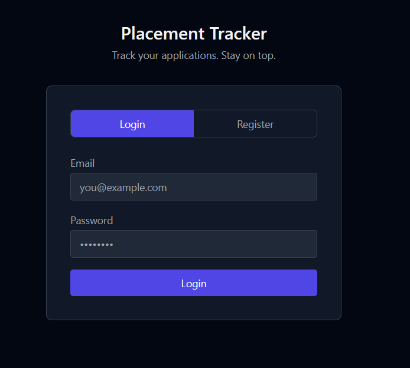
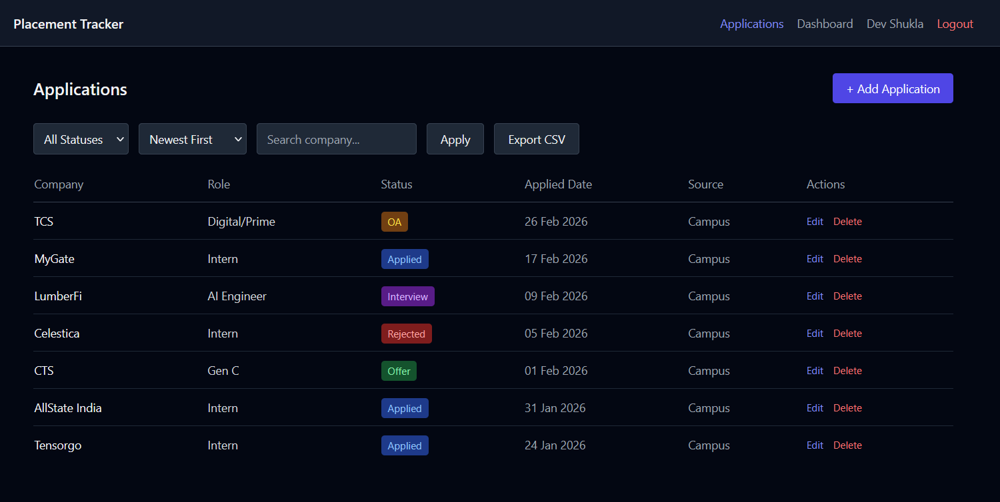
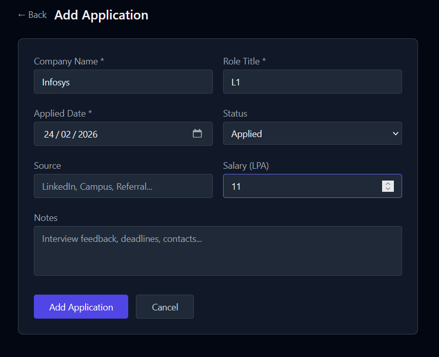
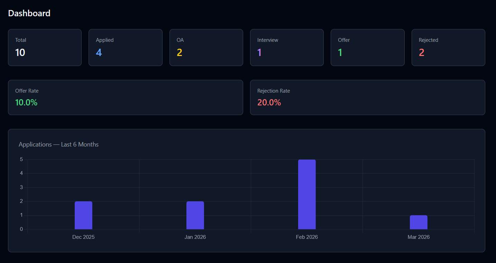

# 🗂️ Placement Tracker

> A personal productivity tool for B.Tech students to track internship and placement applications through every stage of the hiring funnel.

[](https://placement-tracker-api-mbva.onrender.com/login.html)
[](https://nodejs.org)
[](https://expressjs.com)
[](https://mysql.com)
[](https://jwt.io)

---

## 🌐 Live Demo

**[https://placement-tracker-api-mbva.onrender.com/login.html](https://placement-tracker-api-mbva.onrender.com/login.html)**

> ⚠️ Hosted on Render.com free tier — first load may take 30–60 seconds due to cold start.

---

## 📸 Screenshots

### Login


### Applications List


### Add / Edit Application


### Dashboard & Analytics


---

## ✅ Features

- **JWT Authentication** — Register, login, auto logout on token expiry
- **Application CRUD** — Add, edit, delete job applications
- **Status Workflow** — Applied → OA → Interview → Offer → Rejected
- **Audit Trail** — Every status change logged in `status_history` table
- **Filters & Sorting** — Filter by status, search by company, sort by date
- **Pagination** — Server-side pagination with page controls
- **Dashboard Analytics** — Total applications, offer rate, rejection rate
- **Monthly Chart** — Bar chart showing applications over last 6 months
- **CSV Export** — Download all applications as a spreadsheet
- **Security** — Helmet.js, rate limiting, input validation, prepared statements

---

## 🛠️ Tech Stack

| Layer | Technology |
|-------|-----------|
| Runtime | Node.js |
| Framework | Express.js |
| Database | MySQL 8.0 |
| ORM / Driver | mysql2/promise |
| Authentication | JSON Web Tokens (JWT) |
| Password Hashing | bcrypt (12 rounds) |
| Input Validation | express-validator |
| Rate Limiting | express-rate-limit |
| Security Headers | helmet.js |
| Frontend | Vanilla HTML, Tailwind CSS, Vanilla JS |
| Charts | Chart.js |
| Deployment | Render.com (API) + Clever Cloud (MySQL) |

---

## 🏗️ Architecture

This project follows a strict layered architecture where each layer has one responsibility.
```
Route Handler → Validator → Service → Repository → Database
```
```
placement-tracker/
├── config/
│   └── db.js                  # MySQL connection pool
├── middleware/
│   ├── auth.js                # JWT verification → req.user
│   └── errorHandler.js        # Global error handler
├── routes/
│   ├── auth.js                # Auth endpoints
│   ├── applications.js        # Application endpoints
│   └── dashboard.js           # Analytics endpoints
├── validators/
│   ├── authValidator.js       # Register/login validation
│   └── applicationValidator.js
├── services/
│   ├── authService.js         # Auth business logic
│   ├── applicationService.js  # Application business logic
│   └── dashboardService.js    # Analytics calculations
├── repositories/
│   ├── userRepository.js      # User SQL queries
│   └── applicationRepository.js # Application SQL queries
├── utils/
│   └── csvExport.js           # CSV generation
├── public/                    # Static frontend
│   ├── login.html
│   ├── applications.html
│   ├── form.html
│   ├── dashboard.html
│   ├── css/style.css
│   └── js/
│       ├── api.js             # Centralized fetch wrapper
│       ├── auth.js
│       ├── applications.js
│       ├── form.js
│       └── dashboard.js
├── app.js                     # Express app setup
└── server.js                  # Entry point
```

---

## 📡 API Reference

All protected endpoints require `Authorization: Bearer <token>` header.

### Auth

| Method | Endpoint | Auth | Description |
|--------|----------|------|-------------|
| POST | `/api/auth/register` | ❌ | Register new user |
| POST | `/api/auth/login` | ❌ | Login and get JWT |
| GET | `/api/auth/me` | ✅ | Get current user profile |

### Applications

| Method | Endpoint | Auth | Description |
|--------|----------|------|-------------|
| GET | `/api/applications` | ✅ | List with filters and pagination |
| POST | `/api/applications` | ✅ | Create new application |
| GET | `/api/applications/:id` | ✅ | Get single application |
| PUT | `/api/applications/:id` | ✅ | Update application fields |
| DELETE | `/api/applications/:id` | ✅ | Delete application |
| PATCH | `/api/applications/:id/status` | ✅ | Change status + log history |
| GET | `/api/applications/:id/history` | ✅ | Get status audit trail |
| GET | `/api/applications/export/csv` | ✅ | Download CSV |

### Dashboard

| Method | Endpoint | Auth | Description |
|--------|----------|------|-------------|
| GET | `/api/dashboard/summary` | ✅ | Total, by status, offer rate |
| GET | `/api/dashboard/monthly` | ✅ | Last 6 months application counts |

### Standard Response Envelope
```json
// Success
{ "success": true, "data": {} }

// Error
{ "success": false, "error": "message", "code": "ERROR_CODE" }
```

---

## 🗃️ Database Schema

Three normalized tables with foreign key relationships.
```sql
users
  id, name, email (UNIQUE), password_hash, created_at

applications
  id, user_id (FK → users), company_name, role_title,
  status (ENUM), applied_date, source, salary_lpa, notes,
  updated_at, created_at

status_history
  id, application_id (FK → applications),
  from_status, to_status, changed_at
```

**Indexes:**
```sql
INDEX idx_user_status ON applications(user_id, status)
INDEX idx_user_date   ON applications(user_id, applied_date)
```

Both indexes verified with `EXPLAIN` — confirmed `type: ref`, no full table scans.

---

## ⚙️ Local Setup

### Prerequisites
- Node.js 18+
- MySQL 8.0

### Steps
```bash
# 1. Clone the repository
git clone https://github.com/ShuklaDevansh/placement-tracker.git
cd placement-tracker

# 2. Install dependencies
npm install

# 3. Create environment file
cp .env.example .env
# Fill in your values in .env

# 4. Create the database
mysql -u root -p
CREATE DATABASE placement_tracker;
USE placement_tracker;

# 5. Run schema (copy from docs/schema.sql or run manually)

# 6. Start development server
npm run dev
```

Open `http://localhost:3000/login.html`

---

## 🔐 Environment Variables

| Variable | Description | Example |
|----------|-------------|---------|
| `PORT` | Server port | `3000` |
| `DB_HOST` | MySQL host | `localhost` |
| `DB_PORT` | MySQL port | `3306` |
| `DB_USER` | MySQL username | `root` |
| `DB_PASSWORD` | MySQL password | `your_password` |
| `DB_NAME` | Database name | `placement_tracker` |
| `JWT_SECRET` | JWT signing secret | `your_secret_key` |
| `JWT_EXPIRES_IN` | Token expiry | `7d` |

---

## 🛡️ Security

| Control | Implementation |
|---------|---------------|
| Password hashing | bcrypt with 12 rounds |
| JWT expiry | 7 days, verified on every request |
| Input validation | express-validator on all POST/PUT routes |
| Prepared statements | All SQL uses parameterized queries via mysql2 |
| Ownership check | Every query includes `WHERE user_id = req.user.id` |
| Rate limiting | 10 requests per 15 minutes on auth routes |
| Security headers | helmet.js on all responses |
| Secrets management | dotenv, `.env` never committed to Git |

---

## 🚀 Future Enhancements

- **Email reminders** — Weekly digest for stale applications using Nodemailer + node-cron
- **Google OAuth** — Replace password login with OAuth 2.0 via Passport.js
- **Advanced analytics** — Time-in-stage metrics, source effectiveness using SQL window functions
- **Resume attachment** — PDF upload per application via AWS S3 or Cloudinary
- **React frontend** — Replace vanilla HTML with React SPA, backend API requires zero changes

---

## 👨‍💻 Author

**Devansh Shukla**
- GitHub: [@ShuklaDevansh](https://github.com/ShuklaDevansh)

---
